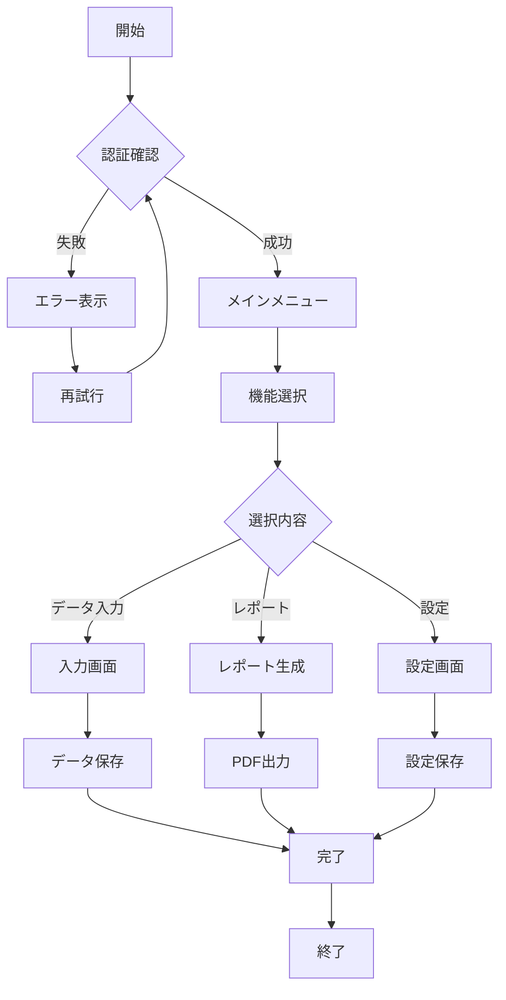

# システムフロー図

## 処理フロー



## 処理詳細

| 処理 | 説明 | 時間 |
|------|------|------|
| 認証 | ユーザー認証を行う | 1秒 |
| データ入力 | フォームからデータを入力 | 30秒 |
| レポート生成 | データからレポートを作成 | 5秒 |
| 設定変更 | システム設定を変更 | 10秒 |

## コード例

```javascript
function authenticate(user, password) {
    // 認証処理
    if (checkCredentials(user, password)) {
        return { success: true, token: generateToken() };
    }
    return { success: false, error: "Invalid credentials" };
}
```