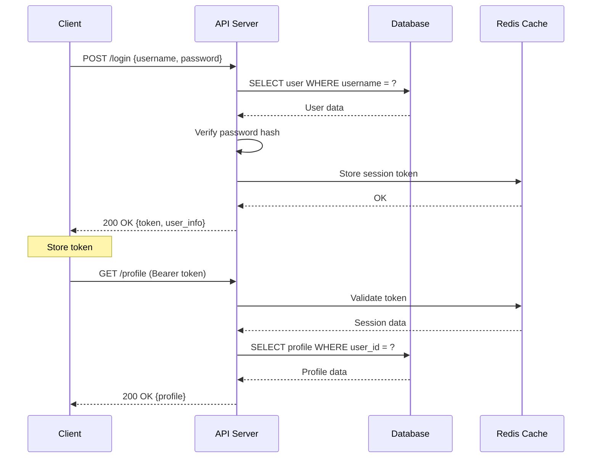
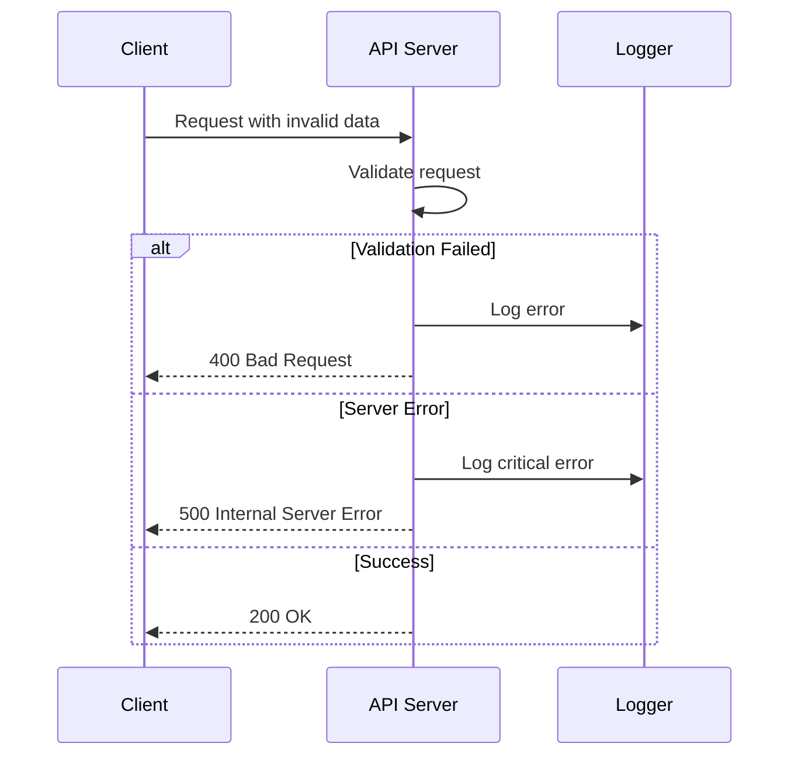

# API通信シーケンス

## 認証フロー

## エラーハンドリング

## API仕様

### エンドポイント一覧

| メソッド | パス | 説明 | レスポンス |
|---------|------|------|------------|
| POST | /login | ログイン | JWT token |
| GET | /profile | プロフィール取得 | User profile |
| PUT | /profile | プロフィール更新 | Updated profile |
| DELETE | /session | ログアウト | Success message |