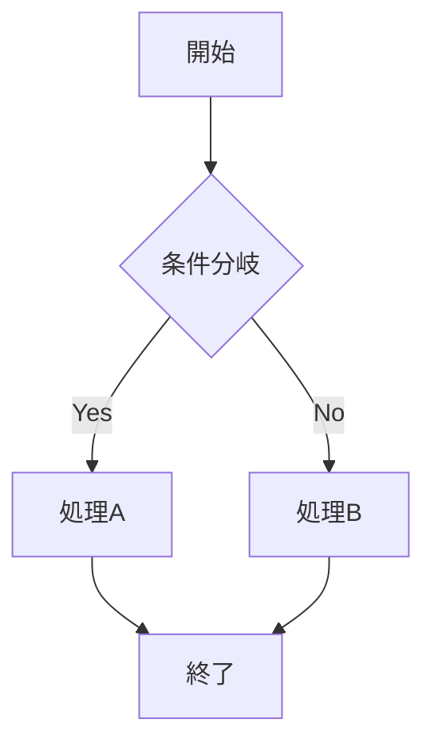
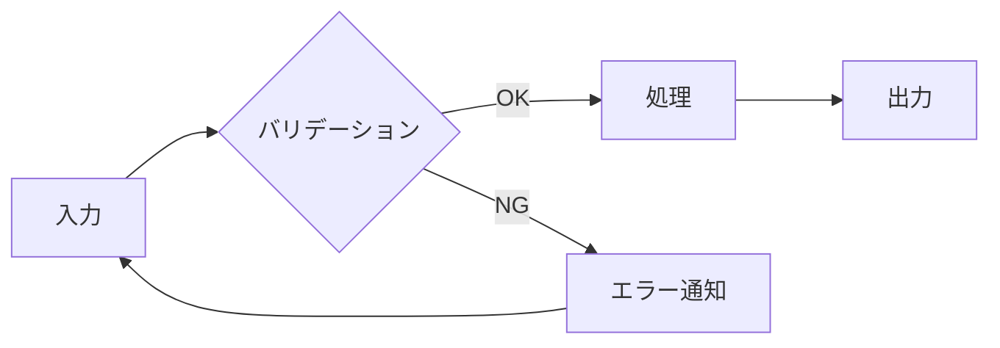
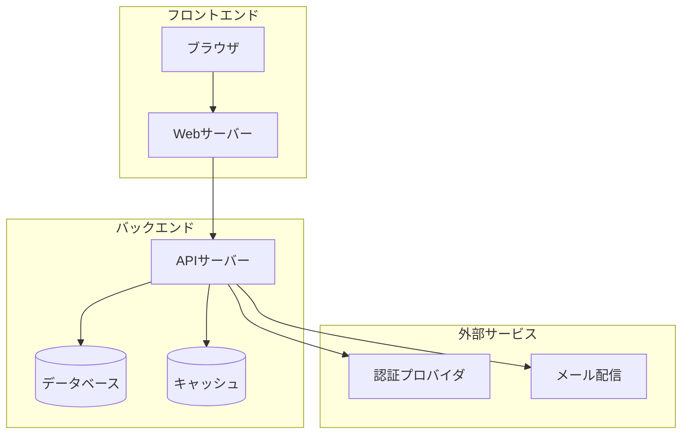
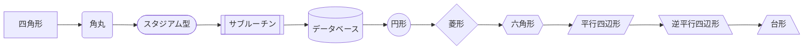
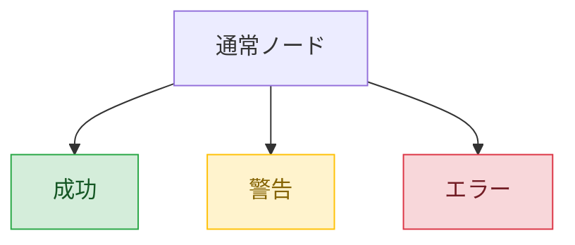
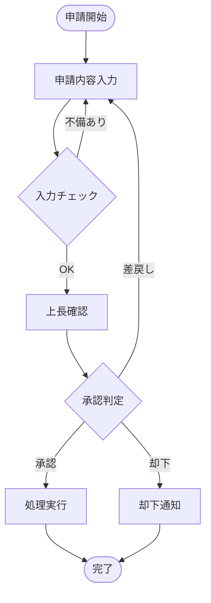
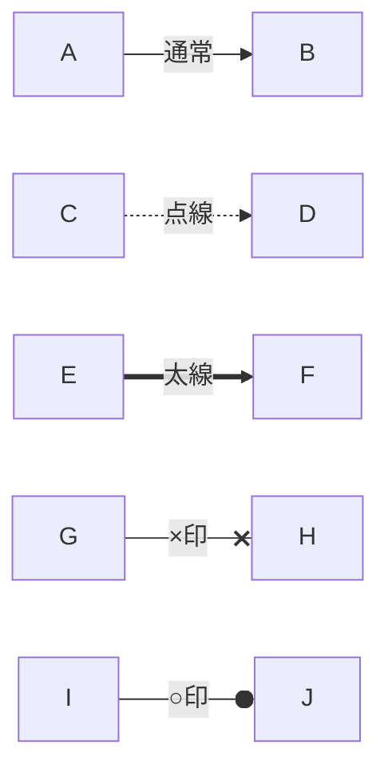

# Mermaid: フローチャートテスト

## 基本フローチャート（TD: 上から下）

```mermaid
graph TD
    A[開始] --> B{条件分岐}
    B -->|Yes| C[処理A]
    B -->|No| D[処理B]
    C --> E[終了]
    D --> E
```

## 左から右（LR）

```mermaid
graph LR
    Input[入力] --> Validate{バリデーション}
    Validate -->|OK| Process[処理]
    Validate -->|NG| Error[エラー通知]
    Process --> Output[出力]
    Error --> Input
```

## サブグラフ

```mermaid
graph TD
    subgraph フロントエンド
        A[ブラウザ] --> B[Webサーバー]
    end
    subgraph バックエンド
        C[APIサーバー] --> D[(データベース)]
        C --> E[(キャッシュ)]
    end
    subgraph 外部サービス
        F[認証プロバイダ]
        G[メール配信]
    end

    B --> C
    C --> F
    C --> G
```

## ノード形状バリエーション

```mermaid
graph LR
    A[四角形] --> B(角丸)
    B --> C([スタジアム型])
    C --> D[[サブルーチン]]
    D --> E[(データベース)]
    E --> F((円形))
    F --> G{菱形}
    G --> H{{六角形}}
    H --> I[/平行四辺形/]
    I --> J[\逆平行四辺形\]
    J --> K[/台形\]
```

## スタイル指定

```mermaid
graph TD
    A[通常ノード] --> B[成功]
    A --> C[警告]
    A --> D[エラー]

    style B fill:#d4edda,stroke:#28a745,color:#155724
    style C fill:#fff3cd,stroke:#ffc107,color:#856404
    style D fill:#f8d7da,stroke:#dc3545,color:#721c24
```

## 日本語ラベル付き業務フロー

```mermaid
graph TD
    Start([申請開始]) --> Input[申請内容入力]
    Input --> Check{入力チェック}
    Check -->|不備あり| Input
    Check -->|OK| Review[上長確認]
    Review --> Approve{承認判定}
    Approve -->|承認| Execute[処理実行]
    Approve -->|差戻し| Input
    Approve -->|却下| Reject[却下通知]
    Execute --> Complete([完了])
    Reject --> Complete
```

## リンクスタイルとテキスト

```mermaid
graph LR
    A -->|通常| B
    C -.->|点線| D
    E ==>|太線| F
    G --x|×印| H
    I --o|○印| J
```
