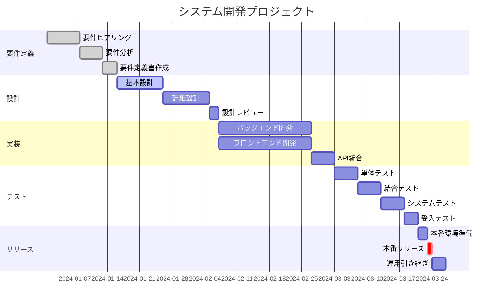

# プロジェクトスケジュール

## 開発スケジュール

## マイルストーン

| フェーズ | 完了予定日 | 成果物 | 担当 |
|---------|------------|--------|------|
| 要件定義 | 2024-01-15 | 要件定義書 | PM |
| 基本設計 | 2024-01-26 | 基本設計書 | アーキテクト |
| 詳細設計 | 2024-02-07 | 詳細設計書 | 開発リード |
| 実装完了 | 2024-03-08 | ソースコード | 開発チーム |
| テスト完了 | 2024-03-26 | テスト報告書 | QAチーム |
| リリース | 2024-03-31 | 本番システム | 全員 |

## リスク管理

### 主要リスク

1. **技術的リスク**
   - 新技術の学習曲線
   - 対策: 事前の技術調査と研修

2. **スケジュールリスク**
   - 要件変更による遅延
   - 対策: バッファを20%確保

3. **リソースリスク**
   - キーパーソンの離脱
   - 対策: 知識共有の徹底