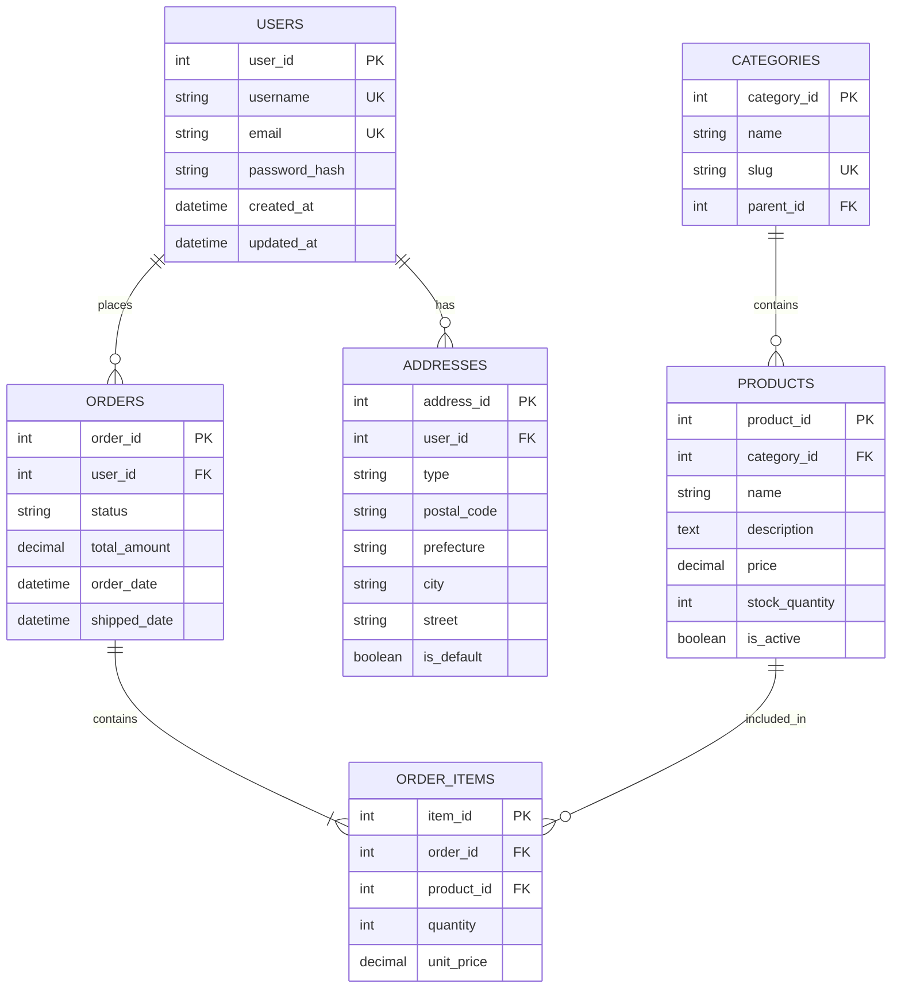
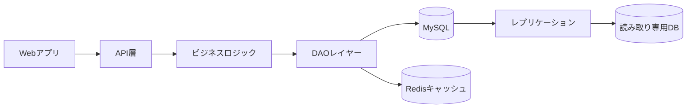

# データベース設計書

## ER図



## テーブル定義

### USERSテーブル

| カラム名 | データ型 | NULL | キー | デフォルト | 説明 |
|---------|----------|------|------|------------|------|
| user_id | INT | NO | PRI | AUTO_INCREMENT | ユーザーID |
| username | VARCHAR(50) | NO | UNI | | ユーザー名 |
| email | VARCHAR(255) | NO | UNI | | メールアドレス |
| password_hash | VARCHAR(255) | NO | | | パスワードハッシュ |
| created_at | TIMESTAMP | NO | | CURRENT_TIMESTAMP | 作成日時 |
| updated_at | TIMESTAMP | NO | | CURRENT_TIMESTAMP | 更新日時 |

### インデックス

```sql
-- ユーザーテーブル
CREATE INDEX idx_users_email ON users(email);
CREATE INDEX idx_users_created_at ON users(created_at);

-- 注文テーブル
CREATE INDEX idx_orders_user_id ON orders(user_id);
CREATE INDEX idx_orders_status ON orders(status);
CREATE INDEX idx_orders_order_date ON orders(order_date);

-- 商品テーブル
CREATE INDEX idx_products_category_id ON products(category_id);
CREATE INDEX idx_products_is_active ON products(is_active);
```

## データフロー

