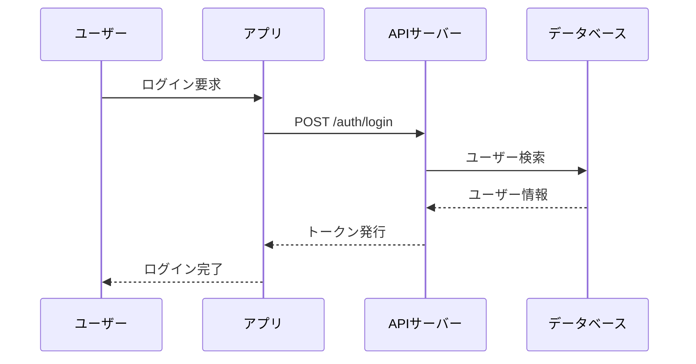
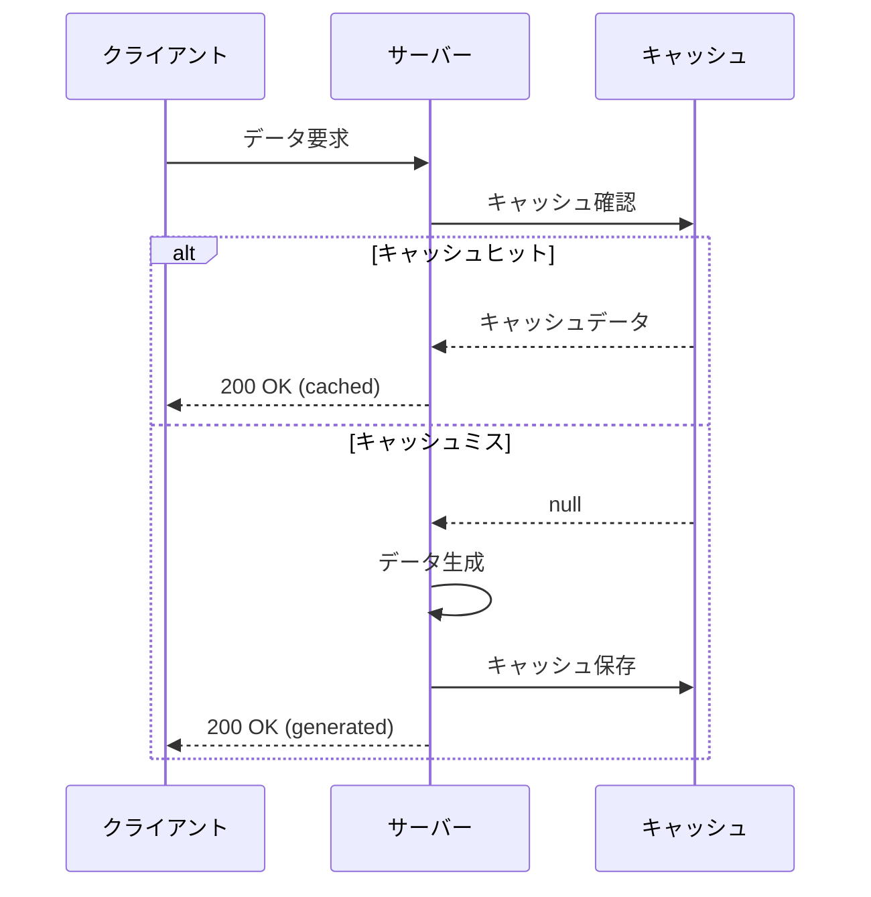
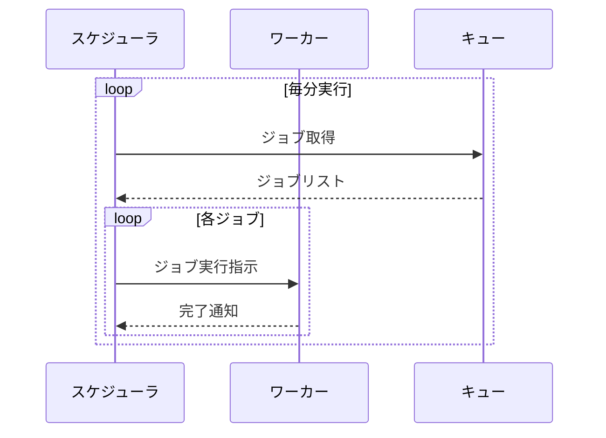
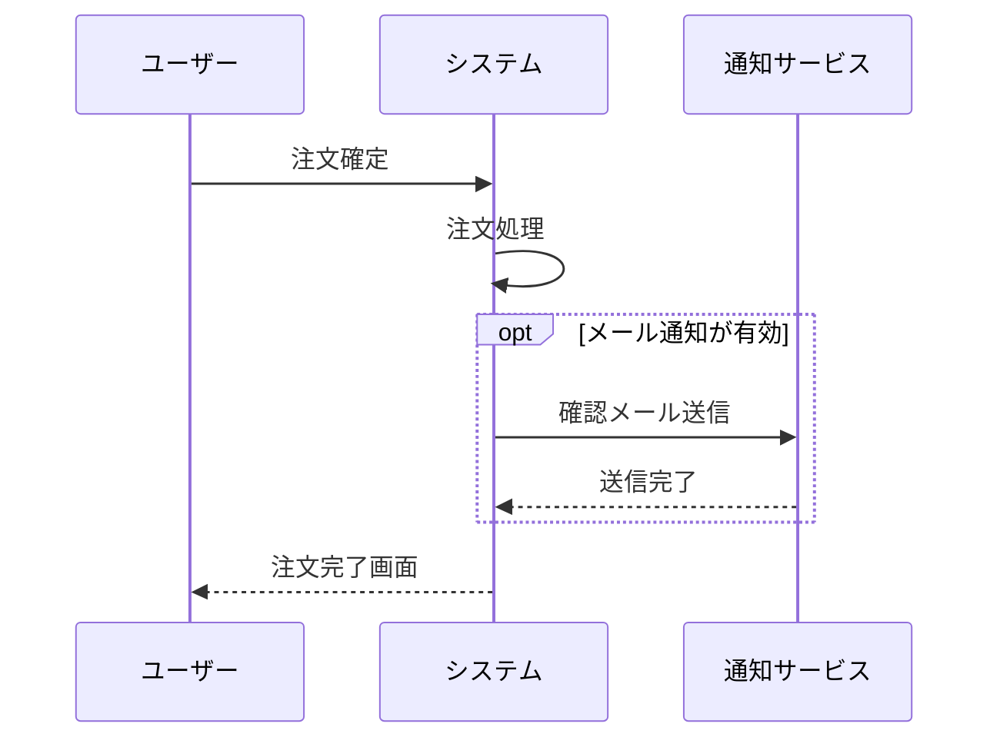
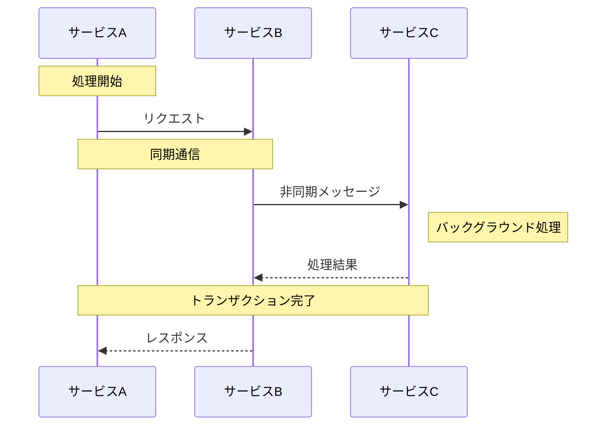
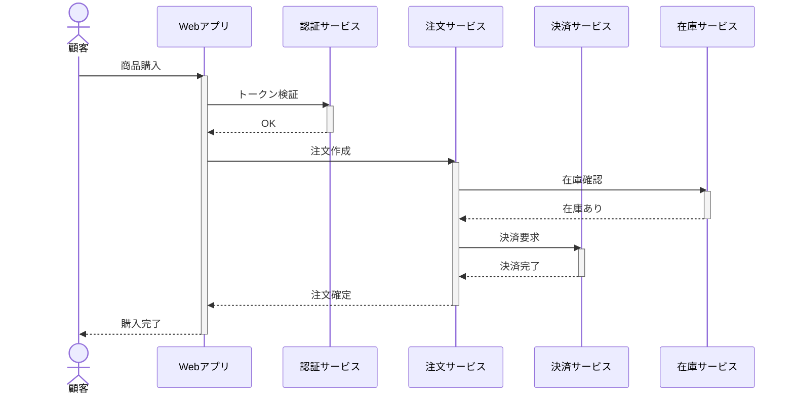
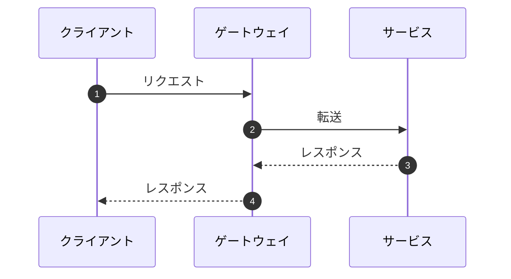

# Mermaid: シーケンス図テスト

## 基本シーケンス

```mermaid
sequenceDiagram
    participant User as ユーザー
    participant App as アプリ
    participant API as APIサーバー
    participant DB as データベース

    User->>App: ログイン要求
    App->>API: POST /auth/login
    API->>DB: ユーザー検索
    DB-->>API: ユーザー情報
    API-->>App: トークン発行
    App-->>User: ログイン完了
```

## alt / else（条件分岐）

```mermaid
sequenceDiagram
    participant C as クライアント
    participant S as サーバー
    participant Cache as キャッシュ

    C->>S: データ要求
    S->>Cache: キャッシュ確認

    alt キャッシュヒット
        Cache-->>S: キャッシュデータ
        S-->>C: 200 OK (cached)
    else キャッシュミス
        Cache-->>S: null
        S->>S: データ生成
        S->>Cache: キャッシュ保存
        S-->>C: 200 OK (generated)
    end
```

## loop（繰り返し）

```mermaid
sequenceDiagram
    participant Scheduler as スケジューラ
    participant Worker as ワーカー
    participant Queue as キュー

    loop 毎分実行
        Scheduler->>Queue: ジョブ取得
        Queue-->>Scheduler: ジョブリスト

        loop 各ジョブ
            Scheduler->>Worker: ジョブ実行指示
            Worker-->>Scheduler: 完了通知
        end
    end
```

## opt（オプション）

```mermaid
sequenceDiagram
    participant U as ユーザー
    participant S as システム
    participant N as 通知サービス

    U->>S: 注文確定
    S->>S: 注文処理

    opt メール通知が有効
        S->>N: 確認メール送信
        N-->>S: 送信完了
    end

    S-->>U: 注文完了画面
```

## Note（注釈）

```mermaid
sequenceDiagram
    participant A as サービスA
    participant B as サービスB
    participant C as サービスC

    Note over A: 処理開始
    A->>B: リクエスト
    Note over A,B: 同期通信
    B->>C: 非同期メッセージ
    Note right of C: バックグラウンド処理
    C-->>B: 処理結果
    Note over A,C: トランザクション完了
    B-->>A: レスポンス
```

## 複数アクターと活性化

```mermaid
sequenceDiagram
    actor Customer as 顧客
    participant Web as Webアプリ
    participant Auth as 認証サービス
    participant Order as 注文サービス
    participant Payment as 決済サービス
    participant Stock as 在庫サービス

    Customer->>Web: 商品購入
    activate Web

    Web->>Auth: トークン検証
    activate Auth
    Auth-->>Web: OK
    deactivate Auth

    Web->>Order: 注文作成
    activate Order

    Order->>Stock: 在庫確認
    activate Stock
    Stock-->>Order: 在庫あり
    deactivate Stock

    Order->>Payment: 決済要求
    activate Payment
    Payment-->>Order: 決済完了
    deactivate Payment

    Order-->>Web: 注文確定
    deactivate Order

    Web-->>Customer: 購入完了
    deactivate Web
```

## 番号付き自動採番

```mermaid
sequenceDiagram
    autonumber
    participant Client as クライアント
    participant GW as ゲートウェイ
    participant Svc as サービス

    Client->>GW: リクエスト
    GW->>Svc: 転送
    Svc-->>GW: レスポンス
    GW-->>Client: レスポンス
```
