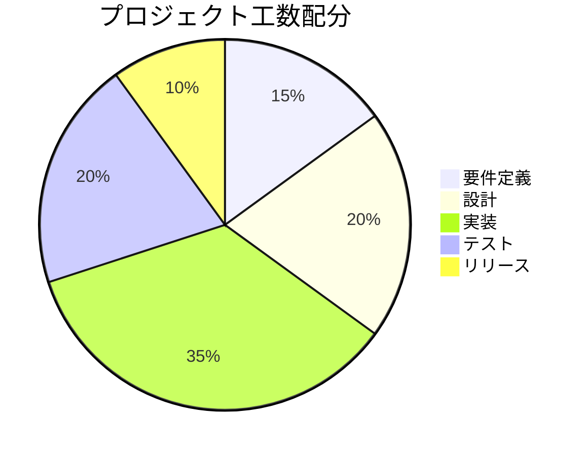
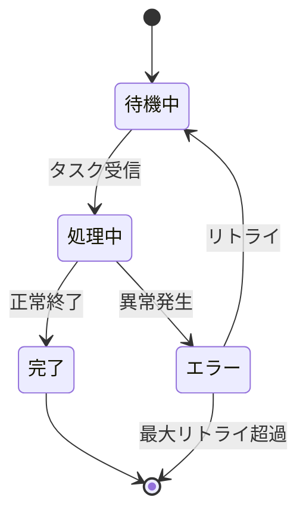
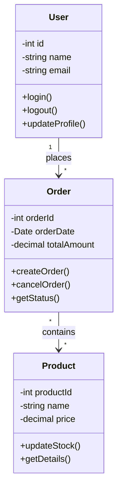

# 総合テストドキュメント

## 1. システム概要

このドキュメントは、**Markdown to PDF Converter**の全機能をテストするためのサンプルです。

### 特徴

- ✅ **Mermaid図表**の完全サポート
- ✅ **日本語**の正確な表示
- ✅ **コードハイライト**機能
- ✅ **テーブル**レイアウト
- ✅ **リスト**の階層表示

## 2. パイチャート



## 3. 状態遷移図



## 4. クラス図



## 5. コード例

### Python
```python
def fibonacci(n):
    """フィボナッチ数列を生成"""
    if n <= 0:
        return []
    elif n == 1:
        return [0]
    elif n == 2:
        return [0, 1]
    else:
        fib = [0, 1]
        for i in range(2, n):
            fib.append(fib[i-1] + fib[i-2])
        return fib

# 使用例
print(fibonacci(10))
```

### JavaScript
```javascript
class Calculator {
    constructor() {
        this.result = 0;
    }
    
    add(x) {
        this.result += x;
        return this;
    }
    
    multiply(x) {
        this.result *= x;
        return this;
    }
    
    getResult() {
        return this.result;
    }
}

// チェーンメソッド
const calc = new Calculator();
const result = calc.add(5).multiply(3).add(2).getResult();
console.log(result); // 17
```

## 6. 複雑なテーブル

| 機能 | 説明 | 優先度 | 工数 | 担当 |
|------|------|--------|------|------|
| ユーザー認証 | JWT基盤の認証システム | 高 | 40h | 山田 |
| データベース設計 | PostgreSQL + Redis | 高 | 32h | 佐藤 |
| API開発 | RESTful API設計 | 中 | 56h | 鈴木 |
| フロントエンド | React + TypeScript | 中 | 80h | 田中 |
| テスト自動化 | Jest + Cypress | 低 | 24h | 高橋 |

## 7. ネストされたリスト

1. **プロジェクト構造**
   1. バックエンド
      - Node.js
      - Express.js
      - データベース
        * PostgreSQL
        * Redis
        * MongoDB
   2. フロントエンド
      - React
      - 状態管理
        * Redux
        * Context API
      - スタイリング
        * CSS Modules
        * styled-components
   3. インフラ
      - AWS
        * EC2
        * RDS
        * S3
      - Docker
      - Kubernetes

## 8. 引用とノート

> 「シンプルさは究極の洗練である」  
> — レオナルド・ダ・ヴィンチ

**注意事項:**
- このドキュメントはテスト用です
- 実際の本番環境とは異なる場合があります
- 最新情報は公式ドキュメントを参照してください

---

## 9. まとめ

このテストドキュメントでは、以下の要素を確認しました：

| テスト項目 | 結果 |
|------------|------|
| Mermaid図表 | ✅ |
| 日本語表示 | ✅ |
| コードハイライト | ✅ |
| テーブル | ✅ |
| リスト | ✅ |
| 引用 | ✅ |

**生成日時:** 2025年1月  
**バージョン:** v1.0.0