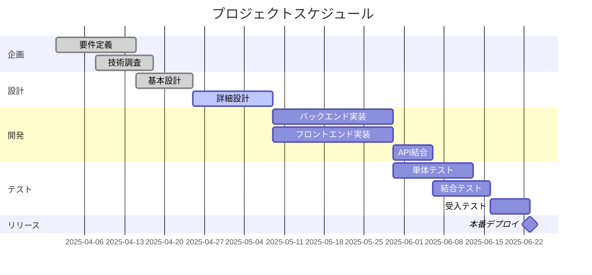
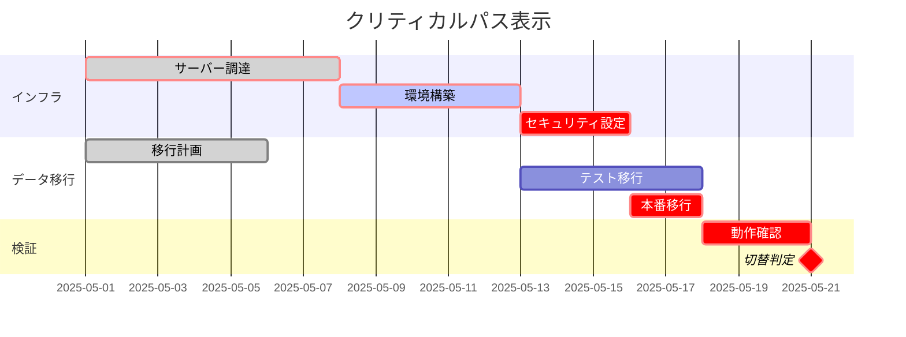
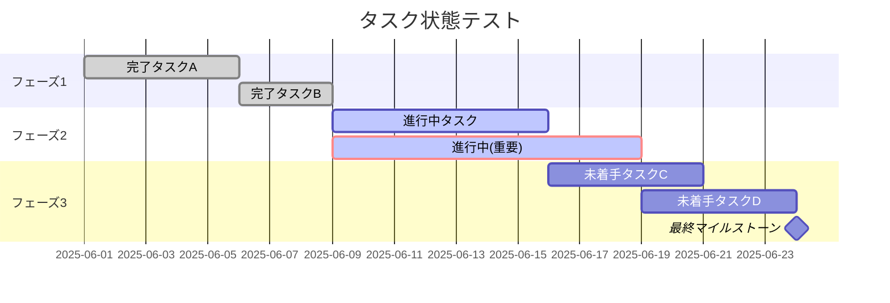
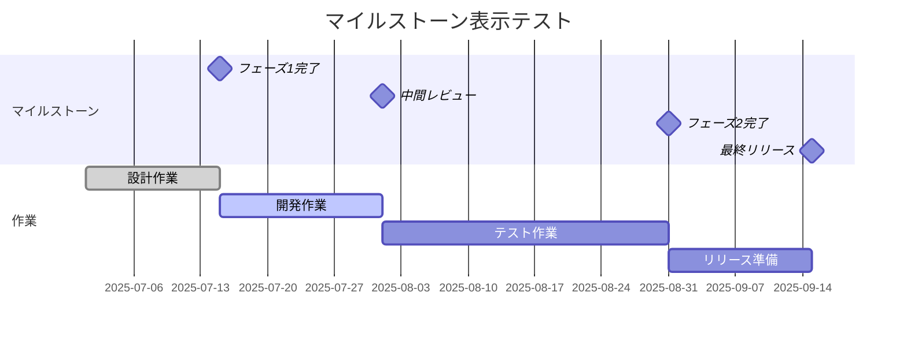

# Mermaid: ガントチャートテスト

## 基本ガントチャート

```mermaid
gantt
    title プロジェクトスケジュール
    dateFormat  YYYY-MM-DD

    section 企画
    要件定義           :done,    req, 2025-04-01, 14d
    技術調査           :done,    research, 2025-04-08, 10d

    section 設計
    基本設計           :done,    design1, after req, 10d
    詳細設計           :active,  design2, after design1, 14d

    section 開発
    バックエンド実装    :         dev1, after design2, 21d
    フロントエンド実装  :         dev2, after design2, 21d
    API結合            :         dev3, after dev1, 7d

    section テスト
    単体テスト          :         test1, after dev1, 14d
    結合テスト          :         test2, after dev3, 10d
    受入テスト          :         uat, after test2, 7d

    section リリース
    本番デプロイ        :milestone, deploy, after uat, 0d
```

## crit（クリティカルパス）

```mermaid
gantt
    title クリティカルパス表示
    dateFormat  YYYY-MM-DD

    section インフラ
    サーバー調達       :crit, done, infra1, 2025-05-01, 7d
    環境構築           :crit, active, infra2, after infra1, 5d
    セキュリティ設定   :crit, infra3, after infra2, 3d

    section データ移行
    移行計画           :done, mig1, 2025-05-01, 5d
    テスト移行         :mig2, after infra2, 5d
    本番移行           :crit, mig3, after infra3, 2d

    section 検証
    動作確認           :crit, verify, after mig3, 3d
    切替判定           :milestone, crit, judge, after verify, 0d
```

## done / active ステータス

```mermaid
gantt
    title タスク状態テスト
    dateFormat  YYYY-MM-DD

    section フェーズ1
    完了タスクA        :done, a1, 2025-06-01, 5d
    完了タスクB        :done, a2, after a1, 3d

    section フェーズ2
    進行中タスク       :active, b1, after a2, 7d
    進行中(重要)       :active, crit, b2, after a2, 10d

    section フェーズ3
    未着手タスクC      :c1, after b1, 5d
    未着手タスクD      :c2, after b2, 5d
    最終マイルストーン :milestone, ms1, after c2, 0d
```

## 複数マイルストーン

```mermaid
gantt
    title マイルストーン表示テスト
    dateFormat  YYYY-MM-DD

    section マイルストーン
    フェーズ1完了     :milestone, m1, 2025-07-15, 0d
    中間レビュー     :milestone, m2, 2025-08-01, 0d
    フェーズ2完了     :milestone, m3, 2025-08-31, 0d
    最終リリース     :milestone, m4, 2025-09-15, 0d

    section 作業
    設計作業         :done, w1, 2025-07-01, 14d
    開発作業         :active, w2, after m1, 17d
    テスト作業       :w3, after m2, 30d
    リリース準備     :w4, after m3, 15d
```
