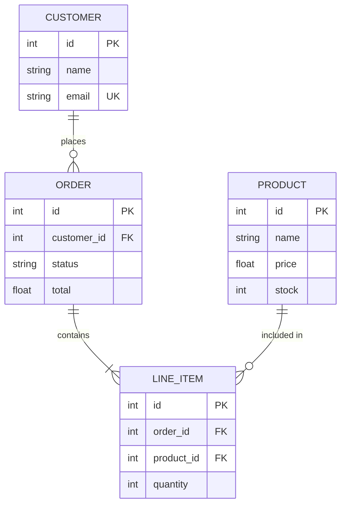
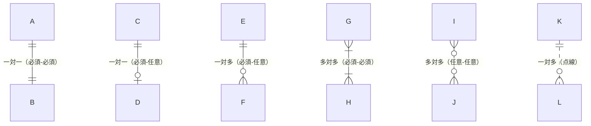
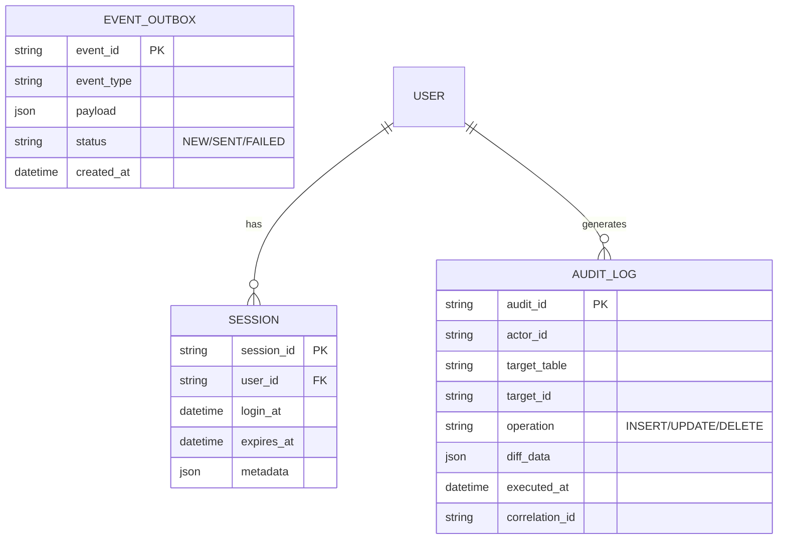
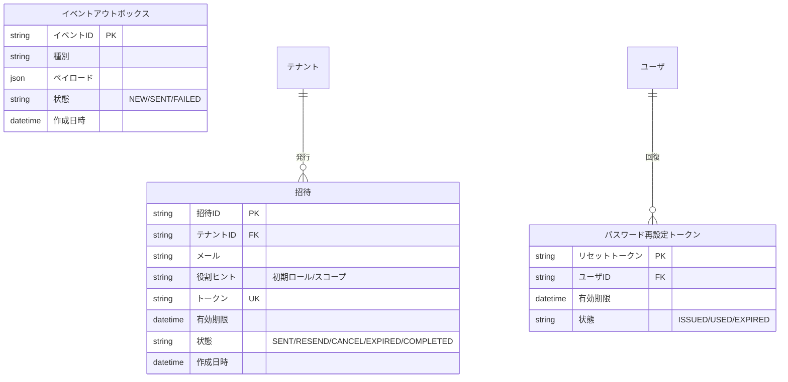
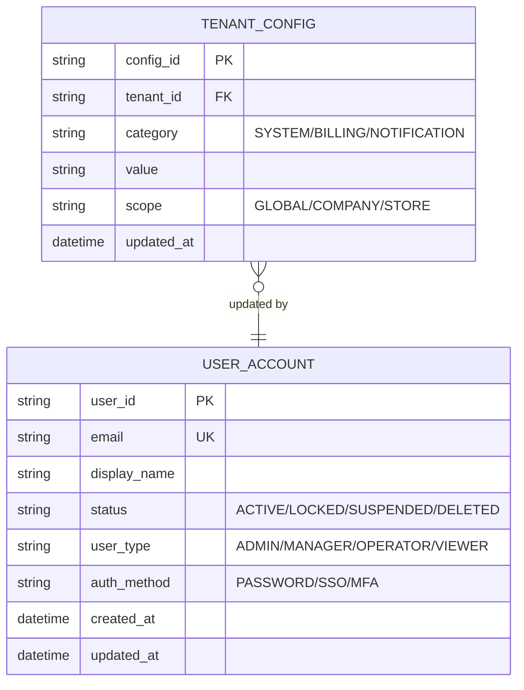

# Mermaid: ER図テスト

基本的なER図構文に加え、エッジケース（datetime型、json型、長い日本語エンティティ名、
"/"を含む文字列値）の変換を確認する。

## 基本ER図

## リレーション記法一覧

## datetime型・json型テスト

datetime型とjson型を含むエンティティ。PDF変換時のパースエラーを検出する。

## 長い日本語エンティティ名テスト

エンティティ名が長い場合のレイアウト崩れを検出する。

## "/"を含む文字列値テスト

属性コメントに "/" を含む場合のパースを確認する。

