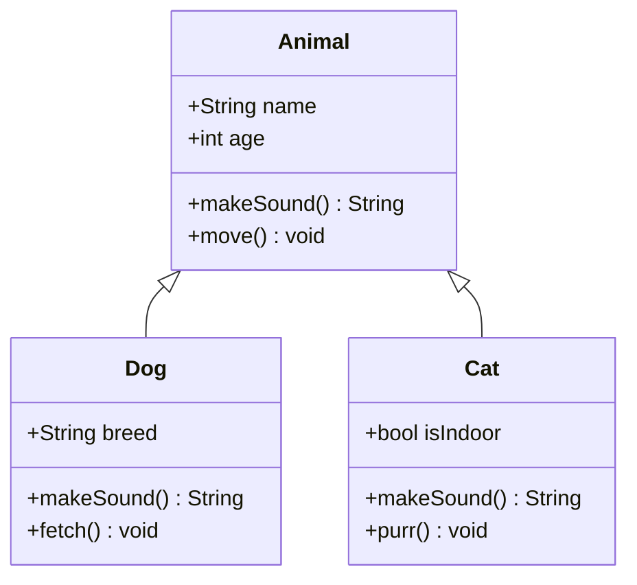
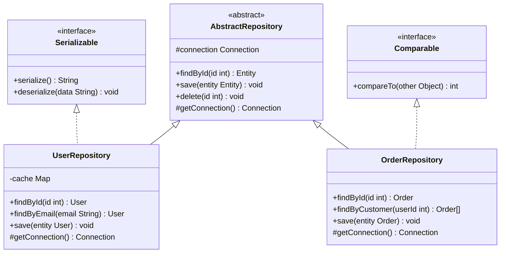
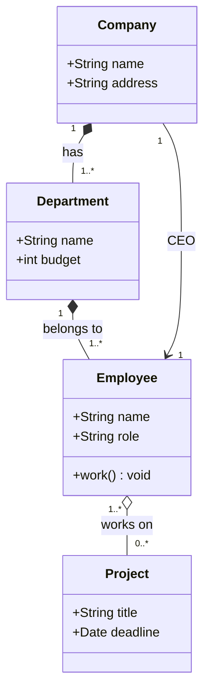
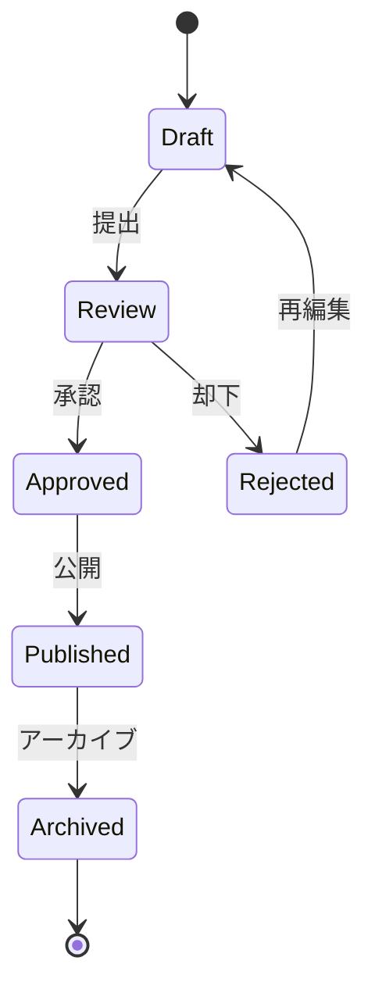
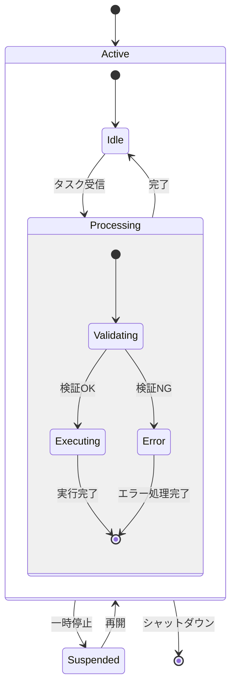
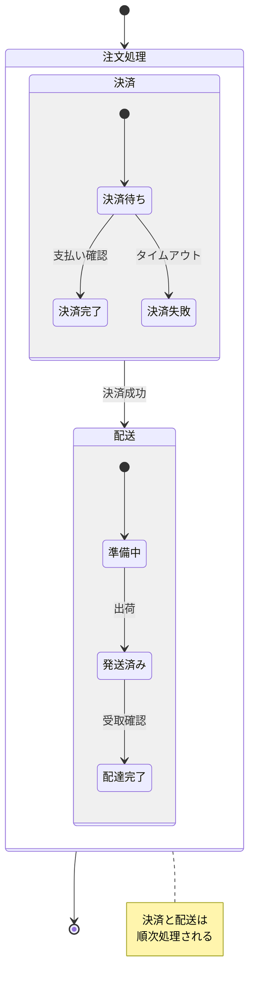

# Mermaid: クラス図・状態遷移図テスト

## クラス図: 基本構造

```mermaid
classDiagram
    class Animal {
        +String name
        +int age
        +makeSound() String
        +move() void
    }

    class Dog {
        +String breed
        +makeSound() String
        +fetch() void
    }

    class Cat {
        +bool isIndoor
        +makeSound() String
        +purr() void
    }

    Animal <|-- Dog
    Animal <|-- Cat
```

## クラス図: 継承と実装

```mermaid
classDiagram
    class Serializable {
        <<interface>>
        +serialize() String
        +deserialize(data String) void
    }

    class Comparable {
        <<interface>>
        +compareTo(other Object) int
    }

    class AbstractRepository {
        <<abstract>>
        #connection Connection
        +findById(id int) Entity
        +save(entity Entity) void
        +delete(id int) void
        #getConnection() Connection
    }

    class UserRepository {
        -cache Map
        +findById(id int) User
        +findByEmail(email String) User
        +save(entity User) void
        #getConnection() Connection
    }

    class OrderRepository {
        +findById(id int) Order
        +findByCustomer(userId int) Order[]
        +save(entity Order) void
        #getConnection() Connection
    }

    AbstractRepository <|-- UserRepository
    AbstractRepository <|-- OrderRepository
    Serializable <|.. UserRepository
    Comparable <|.. OrderRepository
```

## クラス図: 関連・集約・コンポジション

```mermaid
classDiagram
    class Company {
        +String name
        +String address
    }

    class Department {
        +String name
        +int budget
    }

    class Employee {
        +String name
        +String role
        +work() void
    }

    class Project {
        +String title
        +Date deadline
    }

    Company "1" *-- "1..*" Department : has
    Department "1" *-- "1..*" Employee : belongs to
    Employee "1..*" o-- "0..*" Project : works on
    Company "1" --> "1" Employee : CEO
```

---

## 状態遷移図 (v2): 基本

```mermaid
stateDiagram-v2
    [*] --> Draft
    Draft --> Review : 提出
    Review --> Approved : 承認
    Review --> Rejected : 却下
    Rejected --> Draft : 再編集
    Approved --> Published : 公開
    Published --> Archived : アーカイブ
    Archived --> [*]
```

## 状態遷移図 (v2): ネスト状態

```mermaid
stateDiagram-v2
    [*] --> Active

    state Active {
        [*] --> Idle
        Idle --> Processing : タスク受信
        Processing --> Idle : 完了

        state Processing {
            [*] --> Validating
            Validating --> Executing : 検証OK
            Validating --> Error : 検証NG
            Executing --> [*] : 実行完了
            Error --> [*] : エラー処理完了
        }
    }

    Active --> Suspended : 一時停止
    Suspended --> Active : 再開
    Active --> [*] : シャットダウン
```

## 状態遷移図 (v2): 並行状態とノート

```mermaid
stateDiagram-v2
    state "注文処理" as OrderProcess {
        state "決済" as Payment {
            [*] --> 決済待ち
            決済待ち --> 決済完了 : 支払い確認
            決済待ち --> 決済失敗 : タイムアウト
        }
        state "配送" as Shipping {
            [*] --> 準備中
            準備中 --> 発送済み : 出荷
            発送済み --> 配達完了 : 受取確認
        }

        Payment --> Shipping : 決済成功
    }

    [*] --> OrderProcess
    OrderProcess --> [*]

    note right of OrderProcess
        決済と配送は
        順次処理される
    end note
```
