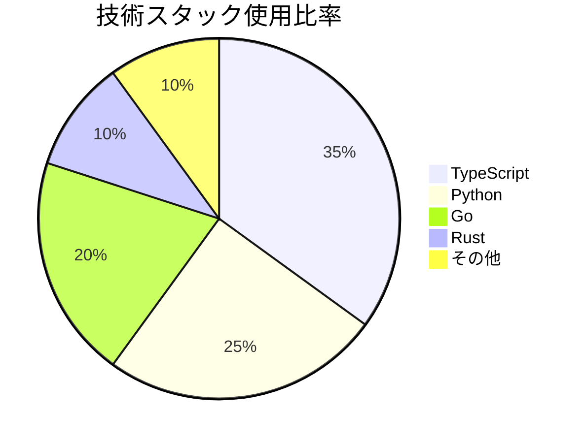
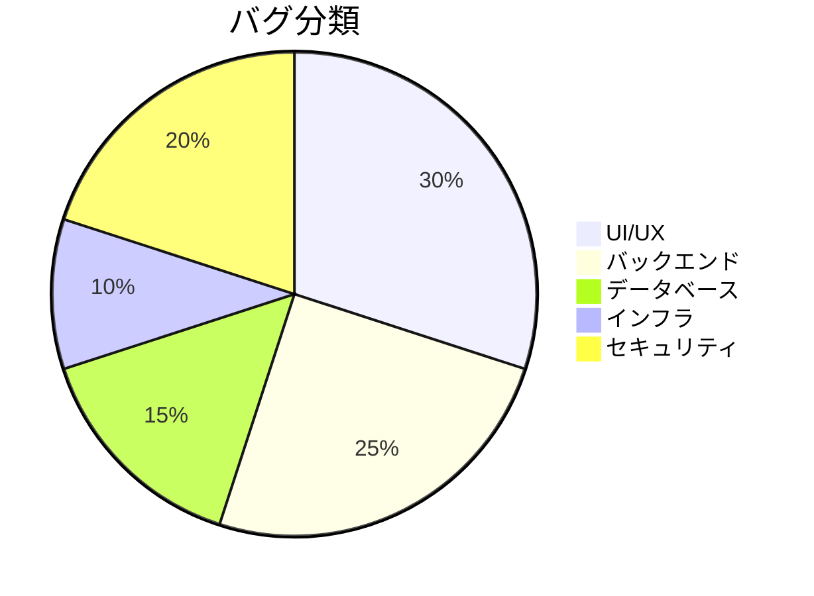
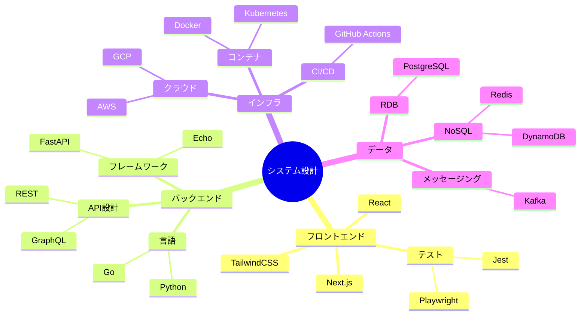
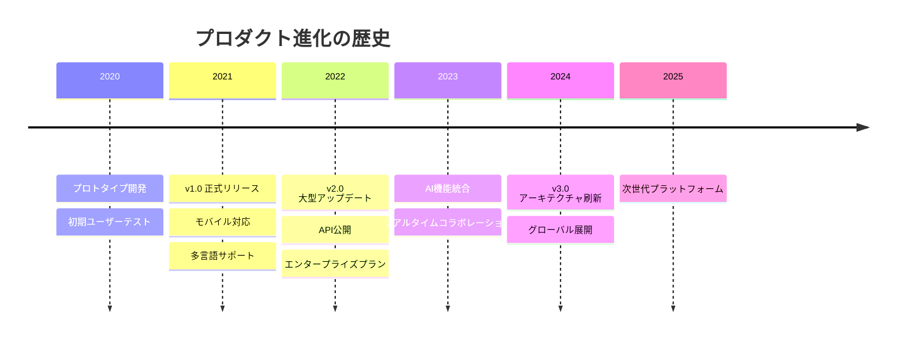
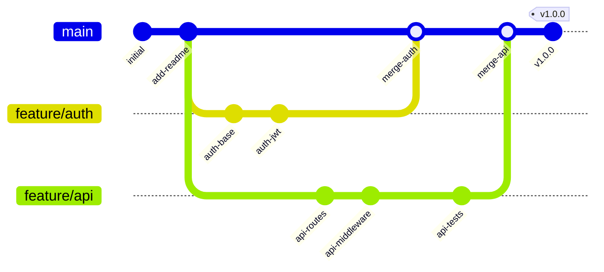

# Mermaid: その他の図テスト

## 円グラフ

```mermaid
pie title 技術スタック使用比率
    "TypeScript" : 35
    "Python" : 25
    "Go" : 20
    "Rust" : 10
    "その他" : 10
```

```mermaid
pie title バグ分類
    "UI/UX" : 30
    "バックエンド" : 25
    "データベース" : 15
    "インフラ" : 10
    "セキュリティ" : 20
```

## マインドマップ

```mermaid
mindmap
  root((システム設計))
    フロントエンド
      React
      Next.js
      TailwindCSS
      テスト
        Jest
        Playwright
    バックエンド
      API設計
        REST
        GraphQL
      言語
        Go
        Python
      フレームワーク
        Echo
        FastAPI
    インフラ
      クラウド
        AWS
        GCP
      コンテナ
        Docker
        Kubernetes
      CI/CD
        GitHub Actions
    データ
      RDB
        PostgreSQL
      NoSQL
        Redis
        DynamoDB
      メッセージング
        Kafka
```

## タイムライン

```mermaid
timeline
    title プロダクト進化の歴史
    2020 : プロトタイプ開発
         : 初期ユーザーテスト
    2021 : v1.0 正式リリース
         : モバイル対応
         : 多言語サポート
    2022 : v2.0 大型アップデート
         : API公開
         : エンタープライズプラン
    2023 : AI機能統合
         : リアルタイムコラボレーション
    2024 : v3.0 アーキテクチャ刷新
         : グローバル展開
    2025 : 次世代プラットフォーム
```

## Gitグラフ

```mermaid
gitGraph
    commit id: "initial"
    commit id: "add-readme"
    branch feature/auth
    checkout feature/auth
    commit id: "auth-base"
    commit id: "auth-jwt"
    checkout main
    branch feature/api
    checkout feature/api
    commit id: "api-routes"
    commit id: "api-middleware"
    checkout main
    merge feature/auth id: "merge-auth"
    checkout feature/api
    commit id: "api-tests"
    checkout main
    merge feature/api id: "merge-api"
    commit id: "v1.0.0" tag: "v1.0.0"
```
