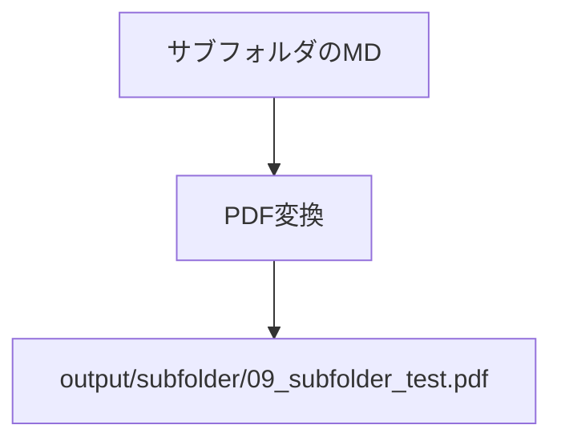

# サブフォルダテスト

このファイルはサブフォルダに配置されたテストファイルです。

## 機能確認

- **recursive: true** の場合、このファイルも変換対象になります
- **recursive: false** の場合、このファイルは無視されます

## Mermaidテスト

## 結果

フォルダ構造が保持されて `output/subfolder/09_subfolder_test.pdf` に出力されます。